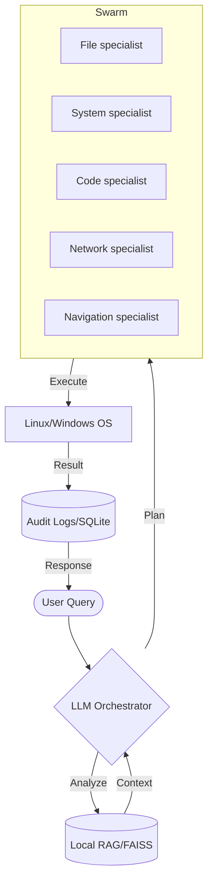

# LIA Architecture: The Intelligence Swarm

LIA (Linux Intelligence Assistant) is designed as a **Local-First Agentic Swarm**. It bridge the gap between human language and Linux system execution without ever sending data to the cloud (unless explicitly configured).

## 1. High-Level Flow

## 2. Core Components

### 🧠 The Orchestrator (`core/orchestrator.py`)
The "Brain" of LIA. It uses a **ReAct (Reasoning + Acting)** loop. 
- **Input**: Human language.
- **Process**: Consults agent capabilities -> Generates a JSON Step Plan.
- **Routing**: Dispatches tasks to the specialized agents.

### 🔌 LLM Bridge (`core/llm_bridge.py`)
A unified abstraction layer using `litellm`. 
- **Priority**: Local Ollama instance (`http://localhost:11434`).
- **Flexibility**: Supports any OpenAI-compatible API as a fallback.

### 📊 Local RAG & Vector Store (`memory/`)
LIA remembers your files and patterns.
- **Embedding Model**: `all-MiniLM-L6-v2` (runs locally on your CPU).
- **Vector DB**: `FAISS`. 
- **Privacy**: No external vector databases used. Everything is in `memory/vector_index`.

### 🛡️ Guardrails & Safety
- **Guardian (`core/guardian.py`)**: A background daemon monitoring system health.
- **Audit Manager (`core/audit.py`)**: Records every single agent action for review.
- **Sandbox (`core/sandbox.py`)**: Optional `Firejail` integration for restricted command execution.

## 3. Data Privacy
- **Telemetry**: Zero.
- **Storage**: All databases (SQLite) and Vector indexes reside on your disk.
- **Cloud**: None by default. LIA works offline.
